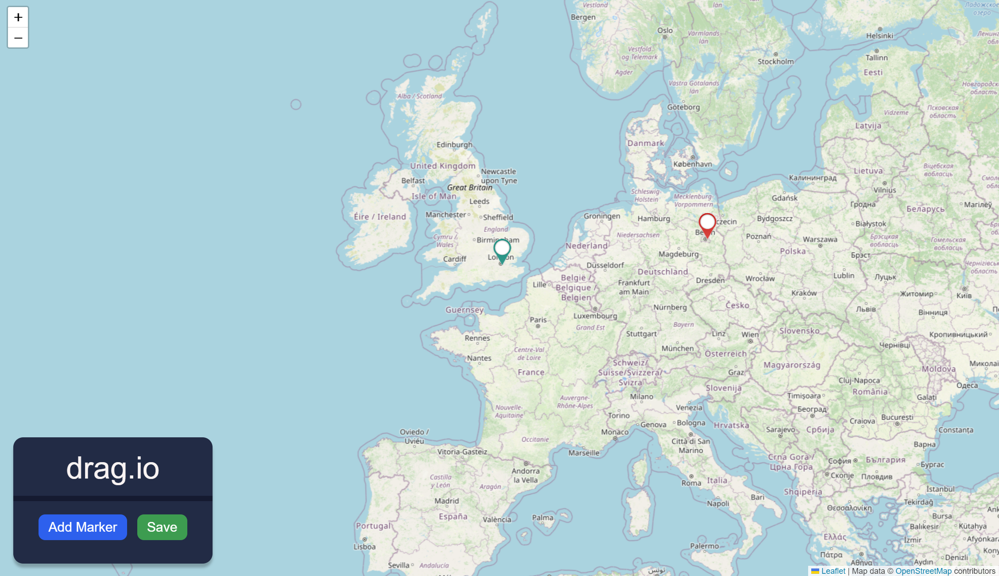

# drag.io
A web page with an interactive map where users can add points, adjust their locations using draggable markers, and save them. 


## Project setup
required `npm`
```
npm install
```
### Compile and run in development environment 
```
npm run serve
```
### Lint and fix files
```
npm run lint
```
### Testing 
``` 
npm run cypress:open
```
Testing can be done using the Cypress UI.
### Roadmap
* Option for deleting markers
* Naming markers and option to search for a marker my name 
* Option to search for a location on the map (by city/country name)

## Resources
Fore more information check Vue3, Leaflet, Cypress


